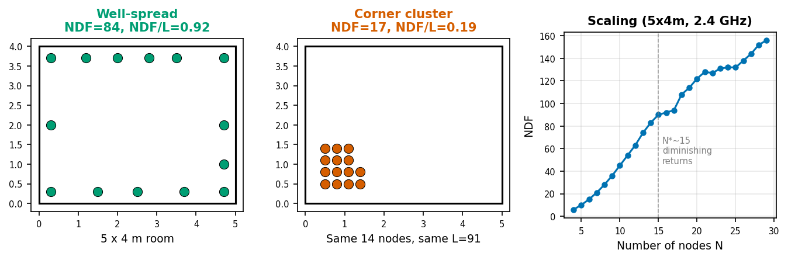

# wifi-ndf

**How many WiFi sensing nodes does your room need?**

`wifi-ndf` computes the Number of spatial Degrees of Freedom (NDF) of a WiFi mesh: the count of truly independent measurements that all pairwise links provide about the room. No CSI data needed, just node coordinates and room geometry.



*Left: 14 well-spread nodes achieve NDF/L=0.92 (92% of links useful). Center: same 14 nodes in a corner waste 81% of links. Right: diminishing returns beyond ~15 nodes.*

## Install

```bash
pip install wifi-ndf
```

## Quick start

```python
from wifi_ndf import compute_ndf

result = compute_ndf(
    nodes=[(0.5, 0.5), (4.5, 0.5), (0.5, 3.5), (4.5, 3.5),
           (2.5, 0.5), (2.5, 3.5), (0.5, 2.0), (4.5, 2.0)],
    room=(5.0, 4.0),
    freq_ghz=2.4,
)

print(result.summary())
# NDF=26 from 28 links (8 nodes), efficiency=0.93, room=5.0x4.0m @ 2.4 GHz

print(result.diagnose())
# Excellent: nearly every link adds independent information.
```

## Deployment rules

| Rule | When | Why |
|------|------|-----|
| `NDF/L > 0.8` | Always check | Below 0.8, links are wasted |
| Spread across 3+ walls | Always | Two walls produce co-linear links |
| Spacing > 0.3m (2.4 GHz) | Dense deployments | Closer nodes have overlapping Fresnel zones |
| Add off-axis nodes | Corridors (AR > 3) | Elongated rooms lack angular diversity |

## Sizing formula

```
NDF ~ min(L, C * sqrt(L * ka))
```

where `L = N*(N-1)/2` links, `ka = 2*pi*a/lambda` is the room's electrical size, and `C ~ 0.97 - 0.07 * aspect_ratio` (R^2=0.92 across five room geometries).

## API

```python
compute_ndf(
    nodes,              # List of (x, y) tuples or (N, 2) array [meters]
    room=(5.0, 4.0),    # (width, height) in meters, or None for auto
    freq_ghz=2.4,       # Carrier frequency
    threshold=0.01,     # Singular value threshold (1% of sigma_max)
    grid_resolution_m=0.25,
) -> NDFResult
```

**NDFResult** fields: `ndf`, `num_nodes`, `num_links`, `efficiency` (NDF/L), `ka`, `singular_values`, `summary()`, `diagnose()`.

## Citation

```bibtex
@misc{khamaisi2026ndf,
  title={How Many Nodes Do We Need? A Spatial Coverage Metric for Wireless Sensing},
  author={Khamaisi, Karim and Rodrigues, Bruno},
  year={2026},
  note={Under review}
}
```

## License

MIT. See [LICENSE](LICENSE).
